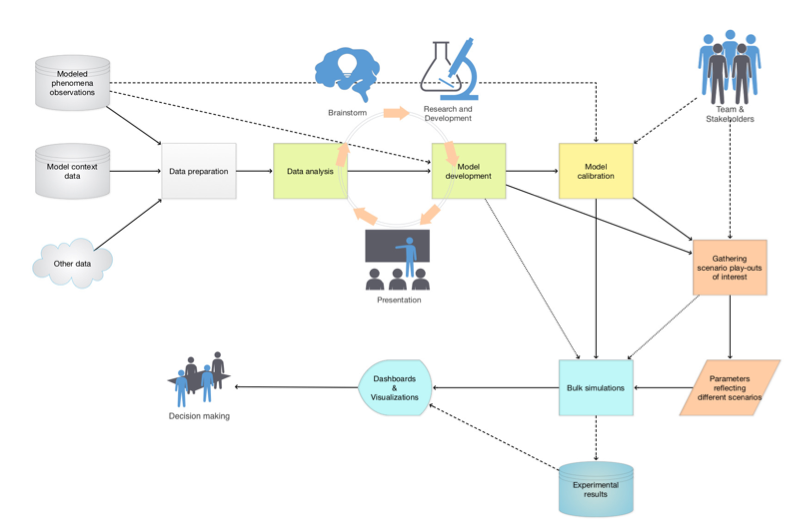
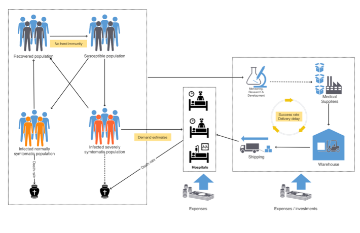
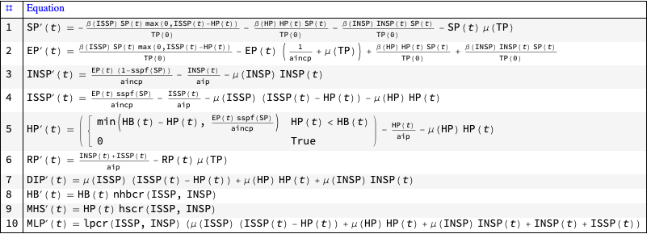
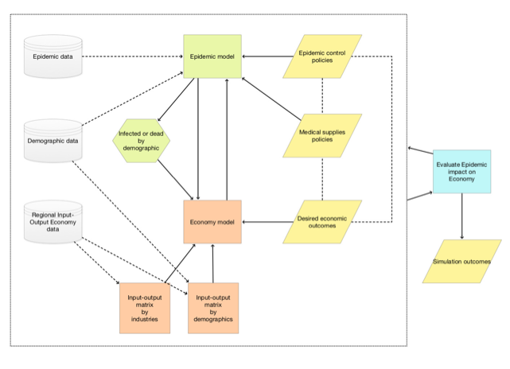
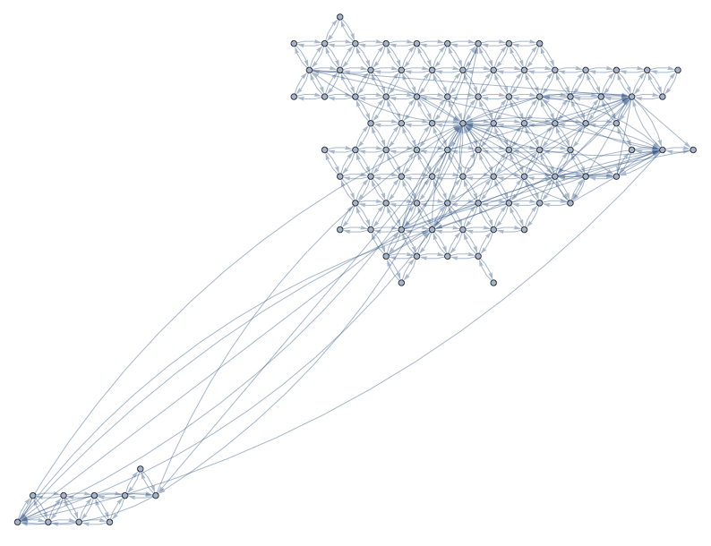
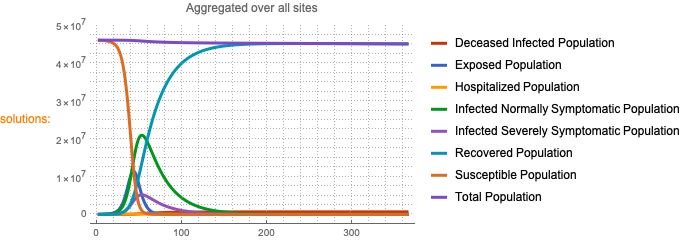
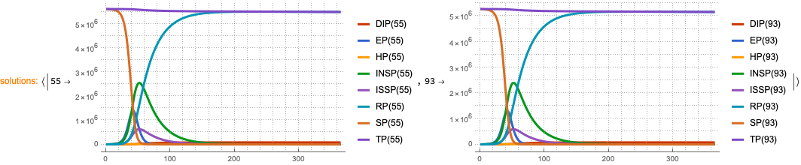
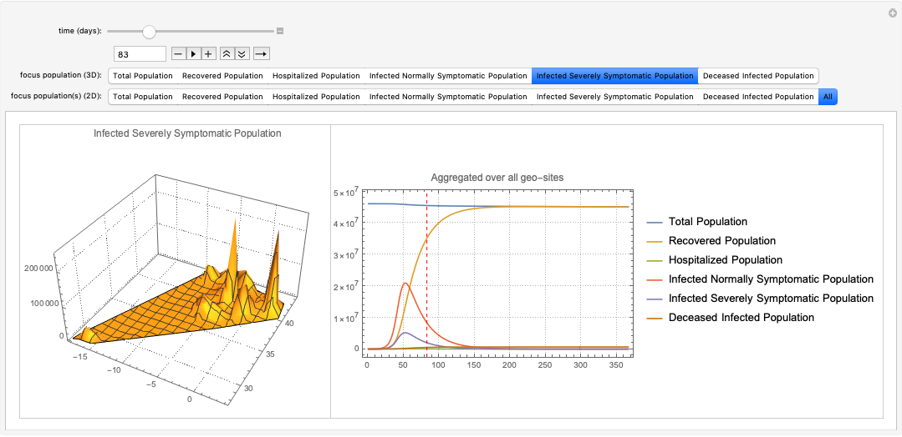
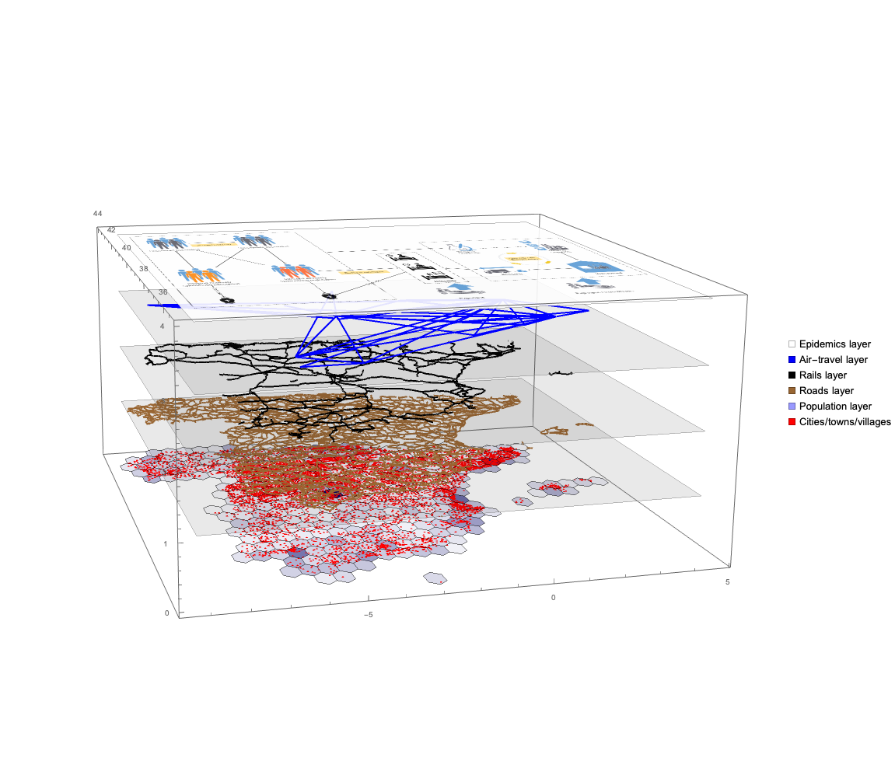
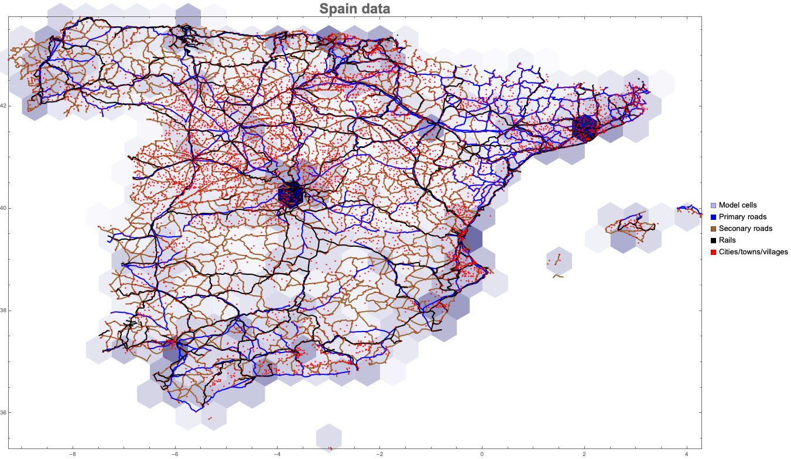

# Large Scale Geo-spatial-temporal Economic Model for Pandemic Propagation and Management

**Analysis for Spain**

**Version 0.3**

Anton Antonov  
Jorge Mateu   
April 2020   

## In brief

The challenges brought forward COVID-19 showed that it is very difficult to make a decision about what are the optimal policies for managing epidemics and pandemics effects.

The evolving of epidemics and pandemics evolving at exponential rates require the ability to make quick, reliable decisions. Days can make all the difference. The health system is unprepared and will be overwhelmed.

In order to develop such a system we need a simulation tool to estimate the spread of the coronavirus in a given country or continent.

In this project, we consider:

1. How can we predict the spread of COVID-19 in Spain and the effects of various related (government) measures?

1. We want to:

    1. the simulate the evolutions of the populations of infected, deceased, healthy people, and

    1. assess the economic impact of the various policies (like quarantine programmes.)

The project further extends and develops a framework for simulations with epidemiological models for multiple sites, [AAr1].


## Details

### The big picture

The main purpose of the designed epidemic-economy modeling framework is to have the ability to do multiple, systematic simulations for different scenario play-outs over large scale geographical regions. The target end-users are decision makers at government level and researchers of pandemic or other large scale epidemic effects.

Here is a diagram that shows the envisioned big picture workflow:



### Large-scale modeling

The standard classical compartmental epidemiology models are not adequate over large geographical areas, like, countries. We use a special software framework that allows large scale simulations using a simple principle workflow:

1. Develop a **single-site model** for relatively densely population geographics area for which the assumptions of the classical models hold.

1. Extend the single-site model into a large-scale **multi-site model** using statistically derived traveling patterns; see [AA3].

1. Data feed the multi-site model using appropriately prepared data.

1. Run multiple simulations to see large scale implications of different policies.

### Input data

The input data is separated into the following classes:

- Population data

- Contagious disease data (infected, deceased, recovered)

- Traveling patterns data (air, land, sea)

- Resources data (availability, production, delivery)

- Policies data (modeling parameter values)

### Single-site Epidemiology Compartmental Models

We have a collection of single-site models that have different properties and different modeling goals, [AAp1, AA6, AA7]. Here is as diagram of a single-site model that includes hospital beds and medical supplies as limitation resources, [AA7]:



Here are the equations of one the epidemiology compartmental models, SEI2HR, [AA6], implemented in [AAp1]:

```mathematica
ModelGridTableForm[SEI2HRModel[t], "Tooltips" -> False]["Equations"] /. {eq_Equal :> TraditionalForm[eq]}
```



### Models combination

Initially we developed two models an Epidemiology Compartmental Model (ECM) and Economy Input-Output Model (EIOM). Each model can be used separately, but we very interested in their modeling power and results of their combination. 

The following diagram shows the envisioned combination of ECM and EIOM:



Here is a list model properties and observations of the approach we take:

- The epidemiology compartmental models have resources limitations (availability, production, delivery) baked-in. 

- Therefore the epidemiology model have an intrinsic economic facet. 

- For large scale economy implications though a separate dedicated economy model have to be developed and combined together with epidemiology model.

- Instead of combining the epidemiology and economy models a simple, modular manner (as shown in the diagram above) we have to consider possible more entwined combinations.

### Modeling paradigms

#### Epidemiology compartmental models

The single-site models are based on compartmental epidemiology models, [Wk1, HH1], and System Dynamics, [Wk3, JS1, BC1].

#### Economy models

The economy models are based on the Input-Output Model, [Wk4, WL1, WL2].

### Expected outputs

#### Single runs

The single-site models can be studied and analyzed through dedicated workflows and related dashboards; see [AA2, AA6, AA7].

We also provide Application Programming Interface (API) that allows of simple, legible model computations specification (data and parameters); see [AA8].

#### Scenario play-outs

The framework allows multiple executions and storage of results. This is most important functionality of the framework that allows the simulation and evaluation of different scenarios and polices. 


## Output examples

### Simulation grid

Land travel and air travel (Spain only):



### Simulation results over whole of Spain



### Simulation results for specified geo-areas




### 3D and 2D plots combination




## Visual aids

### Multi-layered model

Here is a visual aid for the manner in which we plan to utilize data and models:




### Simulation grid over Spain

A more detailed interactive modeling map:




## References

### Articles, books

[Wk1] Wikipedia entry, ["Compartmental models in epidemiology"](https://en.wikipedia.org/wiki/Compartmental_models_in_epidemiology).

[Wk2] Wikipedia entry, ["Coronavirus disease 2019"](https://en.wikipedia.org/wiki/Coronavirus_disease_2019).

[Wk3] Wikipedia entry, ["System dynamics"](https://en.wikipedia.org/wiki/System_dynamics).

[Wk4] Wikipedia entry, ["Input–output model"](https://en.wikipedia.org/wiki/Input–output_model).

[HH1] Herbert W. Hethcote, ["The Mathematics of Infectious Diseases", ](http://leonidzhukov.net/hse/2014/socialnetworks/papers/2000SiamRev.pdf)(2000), SIAM Review. 42 (4): 599–653. Bibcode:2000SIAMR..42..599H. doi:10.1137/s0036144500371907.

[JS1] John D.Sterman, Business Dynamics: Systems Thinking and Modeling for a Complex World. (2000), New York: McGraw.

[BC1] Lucia Breierova,  Mark Choudhari,  [An Introduction to Sensitivity Analysis](https://ocw.mit.edu/courses/sloan-school-of-management/15-988-system-dynamics-self-study-fall-1998-spring-1999/readings/sensitivityanalysis.pdf), (1996), Massachusetts Institute of Technology.

[WL1] Wassily W. Leontief,  Input–Output Economics. 2nd ed., (1986), New York: Oxford University Press.

[WL2] Wassily W. Leontief, The Structure of the U.S. Economy, (1965), Scientific American.

[AA1] Anton Antonov, ["Coronavirus propagation modeling considerations"](https://github.com/antononcube/SystemModeling/blob/master/Projects/Coronavirus-propagation-dynamics/Documents/Coronavirus-propagation-modeling-considerations.md), (2020), [SystemModeling at GitHub](https://github.com/antononcube/SystemModeling).

[AA2] Anton Antonov, ["Basic experiments workflow for simple epidemiological models"](https://github.com/antononcube/SystemModeling/blob/master/Projects/Coronavirus-propagation-dynamics/Documents/Basic-experiments-workflow-for-simple-epidemiological-models.md), (2020), [SystemModeling at GitHub](https://github.com/antononcube/SystemModeling).

[AA3] Anton Antonov, ["Scaling of Epidemiology Models with Multi-site Compartments"](https://github.com/antononcube/SystemModeling/blob/master/Projects/Coronavirus-propagation-dynamics/Documents/Scaling-of-epidemiology-models-with-multi-site-compartments.md), (2020), [SystemModeling at GitHub](https://github.com/antononcube/SystemModeling).

[AA4] Anton Antonov, ["WirVsVirus hackathon multi-site SEI2R over a hexagonal grid graph"](https://github.com/antononcube/SystemModeling/blob/master/Projects/Coronavirus-propagation-dynamics/Documents/WirVsVirus-hackathon-Multi-site-SEI2R-over-a-hexagonal-grid-graph.md), (2020), [SystemModeling at GitHub](https://github.com/antononcube/SystemModeling).

[AA5] Anton Antonov, ["NY Times COVID-19 data visualization"](https://github.com/antononcube/SystemModeling/blob/master/Projects/Coronavirus-propagation-dynamics/Documents/NYTimes-COVID-19-data-visualization.md), (2020), [SystemModeling at GitHub](https://github.com/antononcube/SystemModeling).

[AA6] Anton Antonov, ["SEI2HR model with quarantine scenarios"](https://github.com/antononcube/SystemModeling/blob/master/Projects/Coronavirus-propagation-dynamics/Documents/SEI2HR-model-with-quarantine-scenarios.md)[, ](https://github.com/antononcube/SystemModeling/blob/master/Projects/Coronavirus-propagation-dynamics/Documents/Scaling-of-epidemiology-models-with-multi-site-compartments.md)(2020), [SystemModeling at GitHub](https://github.com/antononcube/SystemModeling).

[AA7] Anton Antonov, ["SEI2HR-Econ model with quarantine and supplies scenarios"](https://github.com/antononcube/SystemModeling/blob/master/Projects/Coronavirus-propagation-dynamics/Documents/SEI2HR-Econ-model-with-quarantine-and-supplies-scenarios.md), (2020), [SystemModeling at GitHub](https://github.com/antononcube/SystemModeling).

[AA8] Anton Antonov, ["Epidemiology Compartmental Modeling Monad Demo"](https://github.com/antononcube/SystemModeling/blob/master/Projects/Coronavirus-propagation-dynamics/WL-notebooks/Epidemiology-Compartmental-Modeling-Monad-Demo.nb), (2020), [SystemModeling at GitHub](https://github.com/antononcube/SystemModeling).

### Repositories, packages

[WRI1] Wolfram Research, Inc., ["Epidemic Data for Novel Coronavirus COVID-19"](https://www.wolframcloud.com/obj/resourcesystem/published/DataRepository/resources/Epidemic-Data-for-Novel-Coronavirus-COVID-19), [WolframCloud](https://www.wolframcloud.com).

[WRI2] Wolfram Research Inc., [USA county records](https://github.com/antononcube/SystemModeling/blob/master/Data/dfUSACountyRecords.csv), (2020), [System Modeling at GitHub](https://github.com/antononcube/SystemModeling).

[NYT1] The New York Times, [Coronavirus (Covid-19) Data in the United States](https://github.com/nytimes/covid-19-data), (2020), GitHub.

[AAr1] Anton Antonov, [Coronavirus propagation dynamics project](https://github.com/antononcube/SystemModeling/tree/master/Projects/Coronavirus-propagation-dynamics), (2020), [SystemModeling at GitHub](https://github.com/antononcube/SystemModeling).

[AAp1] Anton Antonov, ["Epidemiology models Mathematica package"](https://github.com/antononcube/SystemModeling/blob/master/Projects/Coronavirus-propagation-dynamics/WL/EpidemiologyModels.m), (2020), [SystemModeling at GitHub](https://github.com/antononcube/SystemModeling).

[AAp2] Anton Antonov, ["Epidemiology models modifications Mathematica package"](https://github.com/antononcube/SystemModeling/blob/master/Projects/Coronavirus-propagation-dynamics/WL/EpidemiologyModelModifications.m), (2020), [SystemModeling at GitHub](https://github.com/antononcube/SystemModeling).

[AAp3] Anton Antonov, ["Epidemiology modeling visualization functions Mathematica package"](https://github.com/antononcube/SystemModeling/blob/master/Projects/Coronavirus-propagation-dynamics/WL/EpidemiologyModelingVisualizationFunctions.m), (2020), [SystemModeling at GitHub](https://github.com/antononcube/SystemModeling).

[AAp4] Anton Antonov, ["System dynamics interactive interfaces functions Mathematica package"](https://github.com/antononcube/SystemModeling/blob/master/WL/SystemDynamicsInteractiveInterfacesFunctions.m), (2020), [SystemModeling at GitHub](https://github.com/antononcube/SystemModeling).

[AAp5] Anton Antonov, ["Multi-site model simulation Mathematica package"](https://github.com/antononcube/SystemModeling/blob/master/Projects/Coronavirus-propagation-dynamics/WL/MultiSiteModelSimulation.m), (2020), [SystemModeling at GitHub](https://github.com/antononcube/SystemModeling).

[AAp6] Anton Antonov, ["Monadic Epidemiology Compartmental Modeling Mathematica package"](https://github.com/antononcube/SystemModeling/blob/master/Projects/Coronavirus-propagation-dynamics/WL/MonadicEpidemiologyCompartmentalModeling.m), (2020), [SystemModeling at GitHub](https://github.com/antononcube/SystemModeling).
